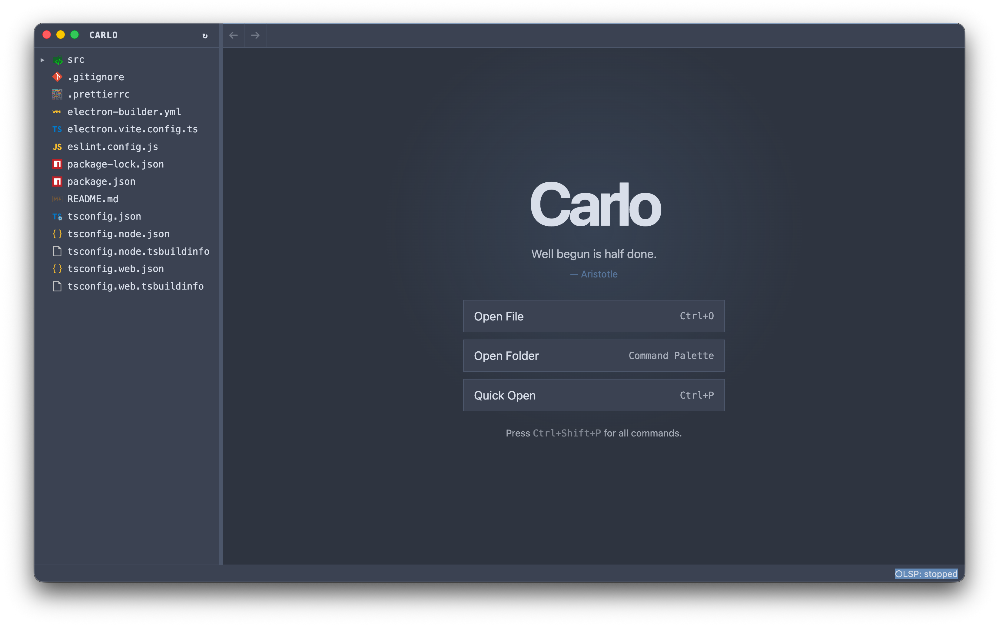

# Carlo



Carlo is a small Electron IDE for people who want the useful part of VS Code without the rest of VS Code.

It is intentionally boring: a file tree, tabs, Monaco, and Language Server Protocol support. No marketplace, no extension platform, no built-in chat, no project system, no telemetry, no side quests. Open a folder, edit files, let your language server do the smart bits.

## Why

VS Code is excellent, but it is also a platform. Carlo is just an editor-shaped IDE:

- faster to start
- smaller in scope
- fewer moving parts
- no bells and whistles
- LSP-first instead of extension-first

If a feature does not help you open code, edit code, navigate code, or get LSP feedback, it probably does not belong here.

## Features

- Workspace file tree
- Monaco editor
- Tabs and editor splits
- Quick open (`Ctrl+P`)
- Command palette (`Ctrl+Shift+P`)
- Save / Save As
- Soft wrap enabled by default, with a command palette toggle
- Go back / go forward navigation
- Basic color theme selection
- Git gutter baseline for changed lines
- LSP integration over stdio
- Configurable language-to-server mapping
- Optional `carlo` shell command for opening folders from a terminal

## Language support

Carlo speaks LSP. Language intelligence comes from language servers installed on your machine or bundled with the app.

### Configure languages

Carlo creates a language configuration file at:

```text
~/.config/carlo/languages.json
```

Open it from the command palette with:

```text
Preferences: Open Language Config
```

Example:

```json
{
  "languageServers": {
    "python": { "command": "pyright-langserver", "args": ["--stdio"] },
    "plaintext": null
  },
  "extensions": {
    ".py": "python",
    ".txt": "plaintext"
  }
}
```

Use `null` for languages that should not start a server.

## Keyboard shortcuts

| Shortcut | Action |
| --- | --- |
| `Ctrl+Shift+P` | Command palette |
| `Ctrl+P` | Quick open file |
| `Ctrl+O` | Open file |
| `Ctrl+S` | Save |
| `Ctrl+Shift+S` | Save as |
| `Ctrl+W` | Close tab |
| `Ctrl+Space` | Trigger suggestions |
| `Ctrl+[` | Go back |
| `Ctrl+]` | Go forward |
| `Ctrl+Alt+Right` | Split editor right |
| `Ctrl+Alt+Down` | Split editor down |
| `Ctrl+=` | Zoom in |
| `Ctrl+-` | Zoom out |
| `Ctrl+0` | Reset zoom |

On macOS, menu accelerators use `Cmd` where Electron maps `CmdOrCtrl`.

## Philosophy

Carlo is not trying to become your operating system. It is an IDE with LSP. That's it.
